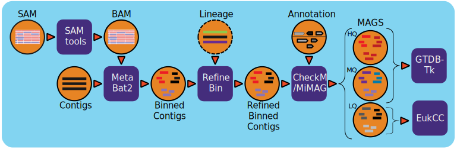

:github_url: https://github.com/microbiomedata/metaMAGs/blob/master/docs/index.rst

..
   Note: The above `github_url` field is used to force the target of the "Edit on GitHub" link
         to be the specified URL. That makes it so that link still works even when this source
         file is incorporated into a different website. You can learn more about the field at:
         https://sphinx-rtd-theme.readthedocs.io/en/stable/configuring.html#confval-github_url

Metagenome Assembled Genomes Workflow (v1.3.9)
=============================================

Workflow Overview
-----------------

The workflow is based on `IMG metagenome binning pipeline <https://www.ncbi.nlm.nih.gov/pmc/articles/PMC6323987/>`_ and has been modified specifically for the `NMDC project <https://www.nature.com/articles/s41579-020-0377-0>`_. For all processed metagenomes, it classifies contigs into bins using MetaBat2. Next, the bins are refined using the functional Annotation file (GFF) from the Metagenome Annotation workflow and optional contig lineage information. The completeness of and the contamination present in the bins are evaluated by CheckM and bins are assigned a quality level (High Quality (HQ), Medium Quality (MQ), Low Quality (LQ)) based on `MiMAG standards <https://www.nature.com/articles/nbt.3893#Tab1>`_.  In the end, GTDB-Tk is used to assign lineage for HQ and MQ bins and EukCC is used to evaluated LQ bins.

The visualization component calls the thirdparty tools `ko_mapper.py <https://github.com/cruizperez/MicrobeAnnotator/blob/master/microbeannotator/pipeline/ko_mapper.py>`_ and `KronaTools <https://github.com/user-attachments/assets/fee36f54-914c-45f7-bc07-379b4da4ea72>`_ to map protein KO information with their respective modules and calculates the completeness percentage of each module present using the custom MicrobeAnnotator1 database and generate barplot/heatmap/krona plots for the KO annotation summary visualization. KEGG module completeness is calculated based on the total steps in a module, the proteins (KOs) required for each step, and the KOs present in each MAG. KEGG modules are defined as functional gene units that are linked to higher metabolic capabilities (pathways), structural complexes, and phenotypic characteristics.

Workflow Availability
---------------------

* The workflow from GitHub uses all the listed docker images to run all third-party tools.
* The workflow is available in GitHub: 

    * https://github.com/microbiomedata/metaMAGs 

* The corresponding Docker image is available in DockerHub:

    * https://hub.docker.com/r/microbiomedata/nmdc_mbin 

    * https://hub.docker.com/r/microbiomedata/nmdc_mbin_vis

Requirements for Execution
--------------------------

(recommendations are in **bold**):
  
- WDL-capable Workflow Execution Tool (**Cromwell**)
- Container Runtime that can load Docker images (**Docker v2.1.0.3 or higher**) 

Hardware Requirements
---------------------

- Disk space: > 100 GB for the CheckM, GTDB-Tk and EukCC databases 
- Memory: ~150GB memory for GTDB-tk.

Workflow Dependencies
---------------------

Third party software (These are included in the Docker image.)
~~~~~~~~~~~~~~~~~~~~~~~~~~~~~~~~~~~~~~~~~~~~~~~~~~~~~~~~~~~~~~~~ 
 
- `Metabat2 v2.15 <https://pubmed.ncbi.nlm.nih.gov/31388474/>`_ (License: `BSD-3-Clause <https://bitbucket.org/berkeleylab/metabat/src/master/license.txt>`_)
- `CheckM v1.2.1 <https://www.ncbi.nlm.nih.gov/pmc/articles/PMC4484387/>`_ (License: `GPLv3 <https://github.com/Ecogenomics/CheckM/blob/master/LICENSE>`_)
- `GTDB-TK v2.1.1 <https://doi.org/10.1093/bioinformatics/btz848>`_ (License: `GPLv3 <https://github.com/Ecogenomics/GTDBTk/blob/master/LICENSE>`_)
- `hmmer v3.3.2 <https://github.com/EddyRivasLab/hmmer>`_ (License: `BSD-3-Clause <https://github.com/EddyRivasLab/hmmer/blob/master/LICENSE>`_)
- `prodigal v2.6.3 <https://github.com/hyattpd/Prodigal>`_ (License: `GPLv3 <https://github.com/hyattpd/Prodigal/blob/GoogleImport/LICENSE>`_)
- `pplacer v1.1.alpha19 <https://github.com/matsen/pplacer>`_ (License `GPLv3 <https://github.com/matsen/pplacer/blob/master/COPYING>`_)
- `FastTree v2.1.11 <http://www.microbesonline.org/fasttree/>`_ (License: `GPLv2 <http://www.microbesonline.org/fasttree/FastTree.c>`_)
- `FastANI v1.33 <https://github.com/ParBLiSS/FastANI>`_ (License: `Apache 2.0 <https://github.com/ParBLiSS/FastANI/blob/master/LICENSE>`_)
- `mash v2.3 <https://github.com/marbl/Mash>`_ (License: `Open-source <https://github.com/marbl/Mash/blob/master/LICENSE.txt>`_)
- `Sqlite 3.39.2 <https://www.sqlite.org/index.html>`_ (License: `Public Domain <https://www.sqlite.org/copyright.html>`_)
- `samtools > v1.6 <https://github.com/samtools/samtools>`_ (License: `MIT License <https://github.com/samtools/samtools/blob/develop/LICENSE>`_)
- `EukCC v2.1.2 <https://github.com/EBI-Metagenomics/EukCC>`_ (License `GPLv3 <https://github.com/EBI-Metagenomics/EukCC/blob/master/LICENSE>`_)
- `metaeuk 4.a0f584d <https://github.com/soedinglab/metaeuk>`_ (License `GPLv3 <https://github.com/soedinglab/metaeuk/blob/master/LICENCE.md>`_)
- `Biopython v1.74 <https://biopython.org>`_ (License: `BSD-3-Clause <https://github.com/biopython/biopython/blob/master/LICENSE.rst>`_)
- `epa-ng v0.3.8 <https://github.com/pierrebarbera/epa-ng>`_ (License: `GPLv3 <https://github.com/pierrebarbera/epa-ng/blob/master/LICENSE>`_)
- `Pymysql <https://github.com/PyMySQL/PyMySQL>`_ (License: `MIT License <https://github.com/PyMySQL/PyMySQL/blob/master/LICENSE>`_)
- `requests <https://github.com/psf/requests>`_ (License: `Apache 2.0 <https://github.com/psf/requests/blob/master/LICENSE>`_)
- `MicrobeAnnotator v2.0.5 <https://github.com/cruizperez/MicrobeAnnotator>`_ (License: `Artistic 2.0 <https://github.com/cruizperez/MicrobeAnnotator/blob/master/LICENSE>`_)
- `KronaTools2 v2.8.1 <https://github.com/marbl/Krona>`_ (License: `Open-source <https://github.com/marbl/Krona/blob/master/KronaTools/LICENSE.txt>`_)

Requisite databases
~~~~~~~~~~~~~~~~~~~~~

- `CheckM <https://www.ncbi.nlm.nih.gov/pmc/articles/PMC4484387/>`_ database is 275MB contains the databases used for the Metagenome Binned contig quality assessment. (requires 40GB+ of memory, included in the image) ::

    wget https://data.ace.uq.edu.au/public/CheckM_databases/checkm_data_2015_01_16.tar.gz
    tar -xvzf checkm_data_2015_01_16.tar.gz
    mkdir -p refdata/CheckM_DB && tar -xvzf checkm_data_2015_01_16.tar.gz -C refdata/CheckM_DB
    rm checkm_data_2015_01_16.tar.gz

- `GTDB-Tk <https://doi.org/10.1093/bioinformatics/btz848>`_ requires ~78G of external data that need to be downloaded and unarchived. (requires ~150GB of memory)::

    wget https://data.gtdb.ecogenomic.org/releases/release214/214.0/auxillary_files/gtdbtk_r214_data.tar.gz
    mkdir -p refdata/GTDBTK_DB && tar -xvzf gtdbtk_r214_data.tar.gz 
    mv release214 refdata/GTDBTK_DB
    rm gtdbtk_r214_data.tar.gz

- `EuKCC <https://genomebiology.biomedcentral.com/articles/10.1186/s13059-020-02155-4>`_ requires ~12G of external data that need to be downloaded and unarchived.::
    
    wget http://ftp.ebi.ac.uk/pub/databases/metagenomics/eukcc/eukcc2_db_ver_1.2.tar.gz
    tar -xvzf eukcc2_db_ver_1.2.tar.gz
    mv eukcc2_db_ver_1.2 EUKCC2_DB
    rm eukcc2_db_ver_1.2.tar.gz

Sample dataset(s)
-----------------

The following test datasets include an assembled contigs file, a SAM.gz file, and functional annotation files:

- dataset: `with HQ, MQ and LQ bins (3.3G) <https://portal.nersc.gov/cfs/m3408/test_data/metaMAGs_test_dataset.tgz>`_ . You can find input/output in the downloaded tar gz file.

Input
----- 

A JSON file containing the following: 

1. Project Name
2. Metagenome Assembled Contig fasta file
3. Sam/Bam file from reads mapping back to contigs.
4. Contigs functional annotation result in gff format
5. Contigs functional annotated protein FASTA file
6. Tab delimited file for `COG <http://reusabledata.org/cogs>`_ annotation.
7. Tab delimited file for `EC <https://reusabledata.org/kegg-ftp>`_ annotation.
8. Tab delimited file for `KO <https://reusabledata.org/kegg-ftp>`_ annotation.
9. Tab delimited file for `PFAM <http://reusabledata.org/pfam>`_ annotation.
10. Tab delimited file for `TIGRFAM <http://reusabledata.org/tigrfams>`_ annotation.
11. Tab delimited file for `CRISPR <https://bmcbioinformatics.biomedcentral.com/articles/10.1186/1471-2105-8-209>`_ annotation.
12. Tab delimited file for Gene Product name assignment.
13. Tab delimited file for Gene Phylogeny assignment.
14. Tab delimited file for Contig/Scaffold lineage.
15. nmdc_mags.map_file: MAP file containing mapping of contig headers to annotation IDs 
16. GTDBTK Database
17. CheckM Database
18. EuKCC Database
19. (optional) nmdc_mags.threads: The number of threads used by metabat/samtools/checkm/gtdbtk. default: 64
20. (optional) nmdc_mags.pthreads: The number of threads used by pplacer (Use lower number to reduce the memory usage) default: 1
 

An example JSON file is shown below::

    {
        "nmdc_mags.proj_name": "nmdc_wfmgan-xx-xxxxxxxx",
        "nmdc_mags.contig_file": "/path/to/Assembly/nmdc_wfmgan-xx-xxxxxxx_contigs.fna",
        "nmdc_mags.sam_file": "/path/to/Assembly/nmdc_wfmgas-xx-xxxxxxx_pairedMapped_sorted.bam",
        "nmdc_mags.gff_file": "/path/to/Annotation/nmdc_wfmgan-xx-xxxxxxx_functional_annotation.gff",
        "nmdc_mags.proteins_file": "/path/to/Annotation/nmdc_wfmgan-xx-xxxxxxx_proteins.faa",
        "nmdc_mags.cog_file": "/path/to/Annotation/nmdc_wfmgan-xx-xxxxxxx_cog.gff",
        "nmdc_mags.ec_file": "/path/to/Annotation/nmdc_wfmgan-xx-xxxxxxx_ec.tsv",
        "nmdc_mags.ko_file": "/path/to/Annotation/nmdc_wfmgan-xx-xxxxxxx_ko.tsv",
        "nmdc_mags.pfam_file": "/path/to/Annotation/nmdc_wfmgan-xx-xxxxxxx_pfam.gff",
        "nmdc_mags.tigrfam_file": "/path/to/Annotation/nmdc_wfmgan-xx-xxxxxxxtigrfam.gff",
        "nmdc_mags.crispr_file": "/path/to/Annotation/nmdc_wfmgan-xx-xxxxxxx_crt.crisprs,
        "nmdc_mags.product_names_file": "/path/to/Annotation/nmdc_wfmgan-xx-xxxxxxx_product_names.tsv",
        "nmdc_mags.gene_phylogeny_file": "/path/to/Annotation/nmdc_wfmgan-xx-xxxxxxx_gene_phylogeny.tsv",
        "nmdc_mags.lineage_file": "/path/to/Annotation/nmdc_wfmgan-xx-xxxxxxx_scaffold_lineage.tsv",
        "nmdc_mags.map_file":"/path/to/Annotation/nmdc_wfmgan-xx-xxxxxxx_contig_names_mapping.tsv",
        "nmdc_mags.gtdbtk_db": "refdata/GTDBTK_DB",
        "nmdc_mags.checkm_db": "refdata/CheckM_DB"
        "nmdc_mags.eukcc2_db": "refdata/EUKCC2_DB/eukcc2_db_ver_1.2"
    }

Output
------

TThe output will have a bunch of files, including statistical numbers, status log and zipped bins files etc. 

Below is an example of all the output files with descriptions to the right.

================================================================================================================================= =============================================================================================
FileName/DirectoryName                                                                                                            Description
================================================================================================================================= =============================================================================================
project_name_mags_stats.json                                                                                                      MAGs statistics in json format
project_name_hqmq_bin.zip                                                                                                         HQ and MQ bins. Each bin tar.gz file*, sqlite db file, ko_matrix** text file.
project_name_lq_bin.zip                                                                                                           LQ bins. Each bin tar.gz file*, sqlite db file, EukCC result csv file, ko_matrix** text file. 
project_name_bin.info                                                                                                             Third party software inforamtion used in the workflow 
project_name_bins.lowDepth.fa                                                                                                     LowDepth (mean cov <1 )  filtered contigs fasta file by metaBat2
project_name_bins.tooShort.fa                                                                                                     TooShort (< 3kb) filtered contigs fasta file by metaBat2
project_name_bins.unbinned.fa                                                                                                     Unbinned fasta file
project_name_checkm_qa.out                                                                                                        Checkm statistics report
project_name_gtdbtk.ar122.summary.tsv                                                                                             Summary tsv file for gtdbtk archaeal genomes (bins) classification
project_name_gtdbtk.bac122.summary.tsv                                                                                            Summary tsv file for gtdbtk bacterial genomes (bins) classification 
`project_name_heatmap.pdf <https://github.com/microbiomedata/nmdc-schema/files/14377315/nmdc_wfmag-11-6scpgx92.1_heatmap.pdf>`_   The Heatmap presents the pdf file containing the KO analysis results for metagenome bins
`project_name_barplot.pdf  <https://github.com/microbiomedata/nmdc-schema/files/14377316/nmdc_wfmag-11-6scpgx92.1_barplot.pdf>`_  The Bar chart presents the pdf file containing the KO analysis results for metagenome bins
`project_name_kronaplot.html <https://github.com/user-attachments/assets/fee36f54-914c-45f7-bc07-379b4da4ea72>`_                  The Krona plot presents the HTML file containing the KO analysis results for metagenome bins
================================================================================================================================= =============================================================================================

\* Each bin tar.gz file has bin's contig fasta (.fna), protein fasta (.faa) and coresponding ko, cog, phylodist, ec, gene_product, gff, tigr, crisprs and pfam annotation text files.

\*\* `ko_matrix <https://github.com/user-attachments/files/16498858/MetaG_test_ko_matrix.txt>`_ file in bin.zip: The row of the matrix is each KO modules and its name/pathway group. The value of each MAG (per column) is the module completeness. This file can be used to generate customized plots with other graphic tools/libraries.

Version History
---------------

- 1.3.14 (release date **02/06/2025**; previous versions: 1.3.13)

Point of contact
----------------

- Original author: Neha Varghese <njvarghese@lbl.gov>

- Package maintainer: Chienchi Lo <chienchi@lanl.gov>
