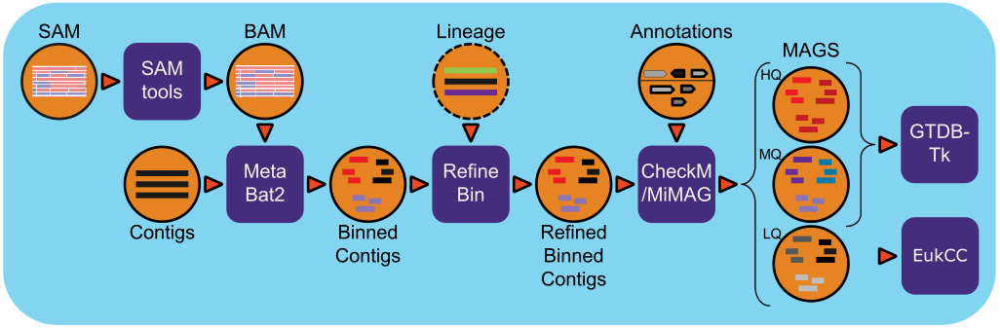

Metagenome assembled genomes generation workflow
================================================

Summary
-------

The workflow is based on `IMG MAGs pipeline <https://www.ncbi.nlm.nih.gov/pmc/articles/PMC6323987/>`_ for metagenome assembled genomes generation.

Workflow Diagram
------------------

Workflow Dependencies
---------------------

Third party software / packages
~~~~~~~~~~~~~~~~~~~~~~~~~~~~~~~

- Biopython v1.74 (BSD-3-Clause)
- Sqlite (Public Domain)
- Pymysql (MIT License)
- requests (Apache 2.0)
- samtools > v1.9 (MIT License)
- Metabat2 v2.15 (BSD-3-Clause)
- CheckM v1.1.2 (GPLv3)
- GTDB-TK v1.1.1 (GPLv3)
- FastANI v1.3 (Apache 2.0)
- FastTree v2.1.10 (GPLv2)

Database 
~~~~~~~~
- `CheckM <https://www.ncbi.nlm.nih.gov/pmc/articles/PMC4484387/>`_ database is a 275MB file contains the databases used for the Metagenome Binned contig quality assessment. (requires 40GB+ of memory)

.. code-block:: bash
	
	mkdir checkM_DB
	wget https://data.ace.uq.edu.au/public/CheckM_databases/checkm_data_2015_01_16.tar.gz
	tar -xvzf checkm_data_2015_01_16.tar.gz -C checkM_DB
	rm checkm_data_2015_01_16.tar.gz

- `GTDB-Tk <https://doi.org/10.1093/bioinformatics/btz848>`_ requires ~27G of external data that need to be downloaded and unarchived.

.. code-block:: bash

	wget https://data.ace.uq.edu.au/public/gtdb/data/releases/release89/89.0/gtdbtk_r89_data.tar.gz
	tar -xvzf gtdbtk_r89_data.tar.gz
	mv release89 GTDBTK_DB
	rm gtdbtk_r89_data.tar.gz

Workflow Availability
---------------------
The workflow is available in GitHub:
https://github.com/microbiomedata/metaMAGs

The container is available at Docker Hub (microbiomedata):

https://hub.docker.com/r/microbiomedata/nmdc_mbin

Test datasets
-------------

`metaMAGs_test_dataset.tgz <https://portal.nersc.gov/cfs/m3408/test_data/metaMAGs_test_dataset.tgz>`_

Details
-------
The workflow is based the `IMG metagenome binning pipeline <https://www.ncbi.nlm.nih.gov/pmc/articles/PMC6323987/>`_ and has been modified specifically for the `NMDC project <https://www.nature.com/articles/s41579-020-0377-0>`_. For all processed metagenomes, it classifies contigs using `MetaBat2 <https://pubmed.ncbi.nlm.nih.gov/31388474/>`_ into bins. Next, the bins are refined by given Annotation (gff) and contig lineage information. The completeness and contamination were evaluated by `CheckM <https://www.ncbi.nlm.nih.gov/pmc/articles/PMC4484387/>`_ and assign High Quality (HQ), Medium Quality (MQ), Low Quality (LQ) bins based on `MiMAG standards <https://www.nature.com/articles/nbt.3893#Tab1>`_ . In the end, `GTDB-Tk <https://doi.org/10.1093/bioinformatics/btz848>`_ was used to assign lineage for HQ and MQ bins.

Inputs
~~~~~~

A json files with following entries:

1. Number of CPUs, 
2. Output directory
3. Project name
4. Metagenome Assembled Contig fasta file
5. Sam/Bam file from reads mapping back to contigs.
6. Text file which containing mapping of headers between SAM and FNA (ID in SAM/FNA<tab>ID in GFF)
7. The database directory path which includes `checkM_DB` and `GTDBTK_DB` subdirectories. 

.. code-block:: JSON

	{
	  "nmdc_mags.cpu":32,
	  "nmdc_mags.outdir":"/path/to/output",
	  "nmdc_mags.proj_name":"3300037552",
	  "nmdc_mags.contig_file":"/path/to/3300037552.a.fna",
	  "nmdc_mags.sam_file":"/path/to/3300037552.bam.sorted.bam",
	  "nmdc_mags.gff_file":"/path/to/3300037552.a.gff",
	  "nmdc_mags.map_file":"/path/to/3300037552.a.map.txt",
	  "nmdc_mags.database":"/path/to/database"
	}

Outputs
~~~~~~~

The output will have a bunch of output directories, files, including statistical numbers, status log and a shell script to reproduce the steps etc. 

The final `MiMAG <https://www.nature.com/articles/nbt.3893#Tab1>`_ output is in `hqmq-metabat-bins` directory and its corresponding lineage result in `gtdbtk_output` directory.::

	|-- 3300037552.bam.sorted
	|-- 3300037552.depth
	|-- 3300037552.depth.mapped
	|-- bins.lowDepth.fa
	|-- bins.tooShort.fa
	|-- bins.unbinned.fa
	|-- checkm-out
	|   |-- bins/
	|   |-- checkm.log
	|   |-- lineage.ms
	|   `-- storage
	|-- checkm_qa.out
	|-- gtdbtk_output
	|   |-- align/
	|   |-- classify/
	|   |-- identify/
	|   |-- gtdbtk.ar122.classify.tree -> classify/gtdbtk.ar122.classify.tree
	|   |-- gtdbtk.ar122.markers_summary.tsv -> identify/gtdbtk.ar122.markers_summary.tsv
	|   |-- gtdbtk.ar122.summary.tsv -> classify/gtdbtk.ar122.summary.tsv
	|   |-- gtdbtk.bac120.classify.tree -> classify/gtdbtk.bac120.classify.tree
	|   |-- gtdbtk.bac120.markers_summary.tsv -> identify/gtdbtk.bac120.markers_summary.tsv
	|   |-- gtdbtk.bac120.summary.tsv -> classify/gtdbtk.bac120.summary.tsv
	|   `-- ..etc 
	|-- hqmq-metabat-bins
	|   |-- bins.11.fa
	|   |-- bins.13.fa
	|   `-- ... etc 
	|-- mbin-2020-05-24.sqlite
	|-- mbin-nmdc.20200524.log
	|-- metabat-bins
	|   |-- bins.1.fa
	|   |-- bins.10.fa
	|   `-- ... etc 

Requirements for Execution
--------------------------

- Docker or other Container Runtime
- `Cromwell <https://github.com/broadinstitute/cromwell>`_ or other WDL-capable Workflow Execution Tool
- ~120GB memory for GTDB-tk.

Running Workflow in Cromwell on Cori
------------------------------------
We provide two ways to run the workflow.  

1. `SlurmCromwellShifter/`: The submit script will request a node and launch the Cromwell.  The Cromwell manages the workflow by using Shifter to run applications. 

2. `CromwellSlurmShifter/`: The Cromwell run in head node and manages the workflow by submitting each step of workflow to compute node where applications were ran by Shifter.

Description of the files in each sud-directory:

 - `.wdl` file: the WDL file for workflow definition
 - `.json` file: the example input for the workflow
 - `.conf` file: the conf file for running Cromwell.
 - `.sh` file: the shell script for running the example workflow

Version History
---------------
- 1.0.0

Point of contact
----------------
Original author: Neha Varghese <njvarghese@lbl.gov>

Package maintainer: Chienchi Lo <chienchi@lanl.gov>
